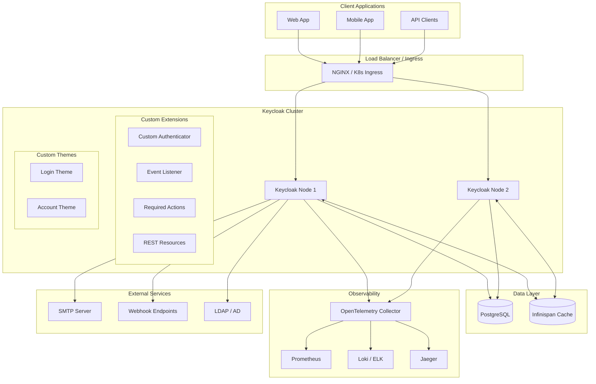
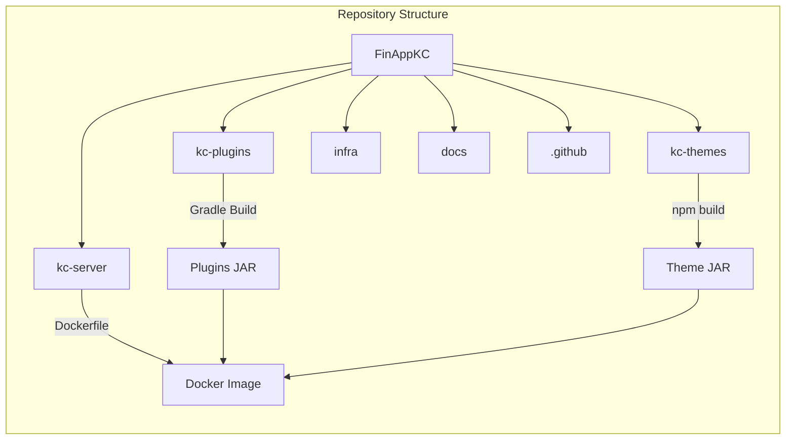
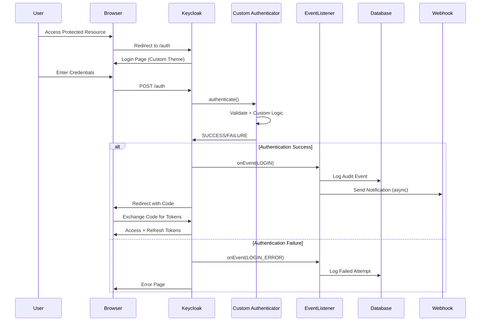
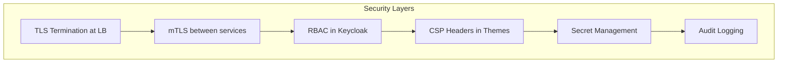
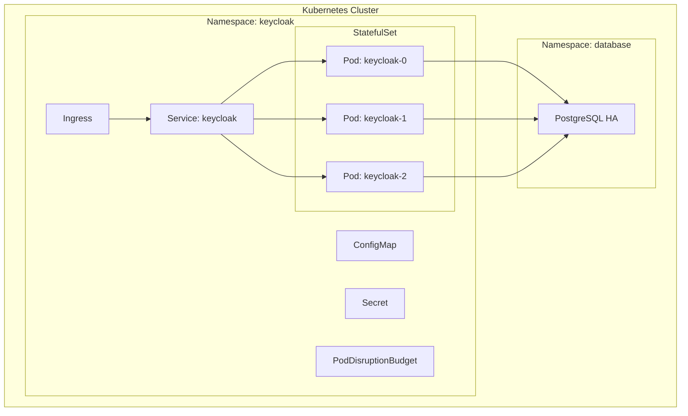

# FinAppKC - Enterprise Identity Provider Architecture

## Overview

FinAppKC — корпоративный Identity Provider на базе Keycloak 25.x (Quarkus distribution),
расширенный кастомными плагинами на Kotlin и темами через Keycloakify.

## High-Level Architecture



## Component Architecture



## Data Flow - Authentication



## Technology Stack

| Component | Technology | Version | Justification |
|-----------|------------|---------|---------------|
| IDP Core | Keycloak | 25.x | Industry standard, active development |
| Runtime | Quarkus | Native | Better startup, lower memory |
| Database | PostgreSQL | 16.x | Mature, reliable, KC default |
| Plugins Language | Kotlin | 1.9.x | Null-safety, concise, JVM compatible |
| Build System | Gradle | 8.x | Better Kotlin support, faster builds |
| Themes | Keycloakify | 10.x | Type-safe, React-based, modern tooling |
| Container | Docker | Multi-stage | Reproducible builds |
| Orchestration | Kubernetes/Helm | Latest | Production scalability |
| Observability | OpenTelemetry | 1.x | Vendor-neutral, comprehensive |
| CI/CD | GitHub Actions | - | Wide adoption, good ecosystem |

## Security Architecture



### Security Controls

1. **Network Security**
   - TLS 1.3 only
   - Strict CSP headers
   - HSTS enabled

2. **Authentication**
   - Brute-force protection
   - Password policies
   - MFA support

3. **Authorization**
   - Fine-grained RBAC
   - Client scopes
   - Audience validation

4. **Secrets Management**
   - No secrets in repo
   - External secrets (Vault/K8s Secrets)
   - Rotation policies

5. **Audit & Compliance**
   - All events logged
   - Structured JSON logs
   - Retention policies

## Deployment Architecture

### Development

```
docker-compose up -d
```

- Single Keycloak instance
- PostgreSQL container
- Hot-reload for themes
- Local debugging

### Production



## ADR Index

- [ADR-001: Gradle over Maven](./adr/001-gradle-over-maven.md)
- [ADR-002: Keycloakify for Themes](./adr/002-keycloakify-themes.md)
- [ADR-003: GitOps for Realm Config](./adr/003-gitops-realm-config.md)
- [ADR-004: OpenTelemetry for Observability](./adr/004-opentelemetry.md)
