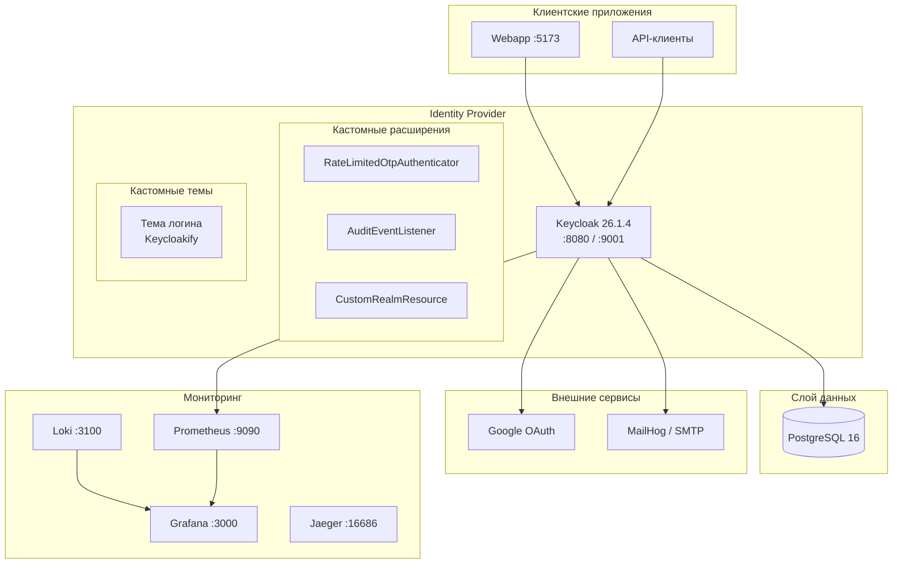
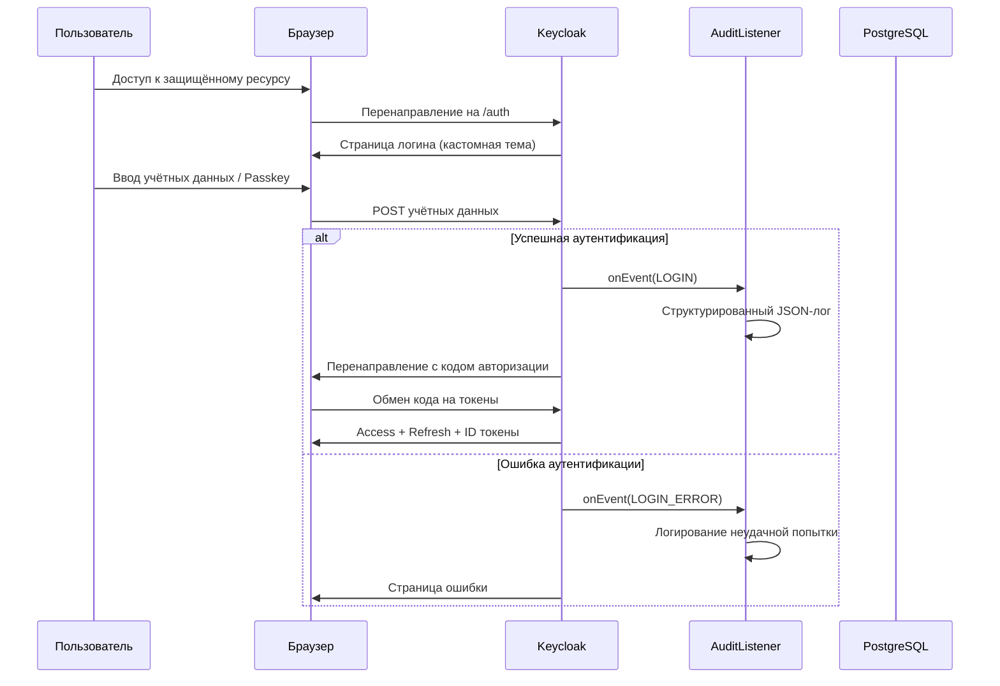

# Архитектура FinAppKC

## Обзор

FinAppKC — корпоративный Identity Provider на базе **Keycloak 26.1.4** (дистрибутив Quarkus), расширенный кастомными плагинами на Kotlin и темой логина через Keycloakify.

## Высокоуровневая архитектура



## Архитектура компонентов

```
FinAppKC/
├── kc-plugins/          # Kotlin SPI-расширения (Gradle)
│   ├── auth/            # RateLimitedOtpAuthenticator
│   ├── events/          # AuditEventListener (структурированное логирование)
│   ├── rest/            # Кастомные REST-эндпоинты
│   └── common/          # PluginConfig, общие утилиты
│
├── kc-themes/           # Keycloakify React-тема логина
│   └── login/           # Кастомные страницы логина
│
├── webapp/              # Демо-фронтенд (React + oidc-spa)
│   └── App.tsx          # Профиль, учётные данные, привязка, сессии
│
├── realm-config/        # Конфигурация realm
│   ├── base/realm-export.json  # Базовый импорт
│   └── init-realm.ps1          # Пост-инициализация через Admin API
│
└── infra/               # Docker Compose + конфигурации мониторинга
```

## Потоки аутентификации

### Браузерный поток (`browser-with-passkey`)

```
Cookie ──> (аутентифицирован? готово)
  │
  ├── WebAuthn Passwordless (Passkey) ──> готово
  │
  ├── Перенаправление Identity Provider (Google) ──> link-only-broker-login
  │
  └── Форма логина/пароля
        └── Условный OTP (если настроен)
```

### Поток социального логина (`link-only-broker-login`)

Google Identity Provider настроен в режиме `link-only`. Новые пользователи **не** регистрируются автоматически — социальный аккаунт может привязать только существующий пользователь.

### Привязка аккаунтов через Webapp

Webapp реализует привязку социальных аккаунтов напрямую через эндпоинт:
```
/realms/{realm}/broker/{provider}/link?client_id=...&redirect_uri=...&nonce=...&hash=...
```
Хеш вычисляется как `SHA-256(nonce + sessionId + clientId + provider)`.

## Поток данных — аутентификация



## Стек технологий

| Компонент | Технология | Версия |
|-----------|------------|--------|
| Ядро IDP | Keycloak (Quarkus) | 26.1.4 |
| База данных | PostgreSQL | 16-alpine |
| Плагины | Kotlin + Gradle | JDK 21 |
| Тема логина | Keycloakify (React) | v11.x |
| Тема аккаунта | Стандартная Keycloak | keycloak.v3 |
| Webapp | React + TypeScript + oidc-spa | — |
| Контейнеры | Docker Compose | профили |
| Мониторинг | Prometheus + Grafana + Loki | — |
| Трассировка | OpenTelemetry + Jaeger | — |
| Email (разработка) | MailHog | — |
| Социальный логин | Google OAuth 2.0 | — |
| 2FA | TOTP + WebAuthn Passwordless | — |

## Конфигурация realm

### Роли

| Роль | Описание |
|------|----------|
| admin | Администратор |
| agent | Агент |
| merchant | Мерчант |
| user | Обычный пользователь |

### Группы

| Группа | Описание |
|--------|----------|
| Administrators | Группа администраторов |
| Users | Группа пользователей |

### Клиенты

| Клиент | Тип | Описание |
|--------|-----|----------|
| finapp-web | public | SPA-фронтенд (webapp) |
| finapp-api | confidential | Бэкенд API |

### Кастомный клиентский scope: `finapp-user-attributes`

Протокольные мапперы:
- `phone` (атрибут пользователя)
- `department` (атрибут пользователя)
- `employee_id` (атрибут пользователя)
- `merchant_id` (атрибут пользователя)
- `groups` (членство в группах)

## Безопасность

### Функции

- Регистрация отключена (пользователей создаёт администратор)
- Сброс пароля по email отключён
- Защита от перебора включена
- Политика паролей: длина(8), цифры, заглавные, строчные, спецсимволы
- MFA: TOTP (условный) + WebAuthn Passwordless (Passkeys)
- Социальный логин: только привязка (без авторегистрации)
- Таймауты сессий настроены
- CSP-заголовки в темах

### WebAuthn (Passkeys)

- Верификация пользователя: preferred
- Аттестация: не требуется
- Таймаут: 60 секунд
- Резидентный ключ: required (passwordless)

## Мониторинг и наблюдаемость

### Метрики Prometheus

Keycloak предоставляет метрики на `:9000/metrics` (внутренний порт, проброшен на `:9001` хоста):
- JVM (куча, GC, потоки)
- HTTP-запросы
- Активные сессии
- Статистика кеша

### Дашборды Grafana

- **Keycloak Audit**: события логина, ошибки, сессии, JVM, аптайм

### Логи Loki

Promtail собирает логи Docker-контейнеров и отправляет в Loki. Grafana визуализирует через LogQL.

### Трассировка Jaeger

OpenTelemetry Collector принимает трассировки по OTLP (gRPC :4317, HTTP :4318) и экспортирует в Jaeger (:16686).

## Индекс ADR

- [ADR-001: Gradle вместо Maven](./adr/001-gradle-over-maven.md)
- [ADR-002: Keycloakify для тем](./adr/002-keycloakify-themes.md)
- [ADR-003: GitOps для конфигурации realm](./adr/003-gitops-realm-config.md)
- [ADR-004: OpenTelemetry для наблюдаемости](./adr/004-opentelemetry.md)
